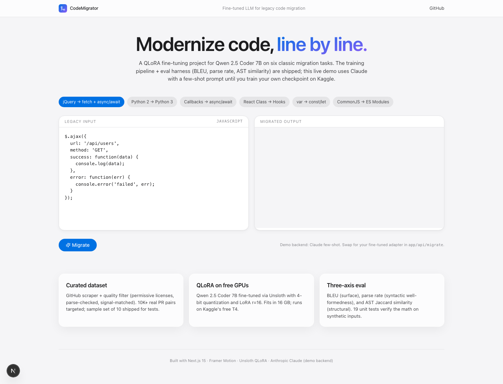

# CodeMigrator — Fine-Tuned LLM for Legacy Code Migration

QLoRA fine-tuning of **Qwen 2.5 Coder 7B** on six classic legacy-to-modern code migrations. Ships the training script, eval harness (BLEU + parse rate + AST similarity), a curated sample dataset, a Kaggle T4 notebook, and a live Next.js demo backed by Claude few-shot until you train your own checkpoint.



## Why This Project

- **Fine-tuning depth is rare on fresher resumes in 2026.** Most candidates have RAG or prompt-engineering work; almost no one has shipped a real QLoRA pipeline with calibrated eval.
- Demonstrates the full ML lifecycle a junior MLE/AI-eng would touch: dataset curation, training infra, evaluation, model serving, and a UI that calls the model.
- Built so the engineering scaffold is real even before the GPU run: the eval harness, filter, schema, and Next.js demo all work today on a CPU laptop.

## What's Built

**Live and tested (CPU-runnable):**

- **Schema + sample dataset** (`code_migrator/data/schema.py`, `examples/dataset/sample.jsonl`) — 10 hand-curated migration pairs spanning all six task types, in the same JSONL shape the trainer consumes.
- **Quality filter** (`code_migrator/data/filter.py`) — length bounds, permissive-license whitelist, legacy/modern signal-matching, AST parse check for Python, brace-balance for JS. Aggressive on purpose; "fewer high-signal pairs" beats "10K noisy pairs."
- **GitHub PR scraper** (`code_migrator/data/scraper.py`) — search queries per migration type, lazy generator over matched PRs, deduplication-friendly output.
- **Eval harness** (`code_migrator/eval/metrics.py`) — three orthogonal signals (BLEU surface similarity, parse rate, AST Jaccard similarity). 19 unit tests pin the math down: identical → 1.0 / broken → 0.0 / renamed-but-structurally-equivalent → high.
- **Side-by-side comparison** (`code_migrator/eval/compare.py`) — runs N predictors over the same eval set and renders a table for the model card.
- **Inference layer** (`code_migrator/inference/predict.py`) — three concrete backends: `LocalAdapterPredictor` (Unsloth + LoRA, GPU), `ClaudePredictor` (few-shot prompt, demo backend), `EchoPredictor` (baseline).
- **Next.js 15 demo UI** with the six migration tasks side-by-side, calling Claude until you swap in your own checkpoint.

**GPU-only (run on Kaggle/Colab):**

- **Training script** (`code_migrator/train/train.py`) — Unsloth + QLoRA on Qwen 2.5 Coder 7B, 4-bit quantization, LoRA r=16 across all attention + MLP projections. Sized to fit a T4 (~16 GB).
- **Kaggle notebook** (`notebooks/kaggle_train.ipynb`) — wraps the train script with the right install incantation. Click Run All on Kaggle, get an adapter back.

## Tech Stack

| Component | Tool |
|---|---|
| Base model | **Qwen 2.5 Coder 7B Instruct** (open weights) |
| Fine-tuning | **QLoRA via Unsloth** (2x faster on T4, 4-bit quantization, LoRA adapters) |
| GPU | **Kaggle free T4** (30 hrs/week quota; full run ~3-4 hours for 10K examples) |
| Training framework | TRL `SFTTrainer` over HuggingFace transformers |
| Dataset source | Real GitHub migration PRs via the search API (`PyGithub`) |
| Eval | sacrebleu (BLEU) + Python `ast` (parse + AST Jaccard) |
| Inference | Unsloth `FastLanguageModel.for_inference` for the local backend; Anthropic Claude with a few-shot prompt for the demo |
| Demo UI | Next.js 15 + Tailwind v3 + Framer Motion (design Skill applied) |
| Tests | pytest (19 tests covering schema, filter, eval) |
| CI | GitHub Actions (Python 3.11 & 3.12 + Next.js build) |

## Project Structure

```
code-migrator/
├── code_migrator/                      # Python package
│   ├── data/
│   │   ├── schema.py                   # MigrationPair pydantic model + prompt format
│   │   ├── scraper.py                  # GitHub search → PR candidates
│   │   └── filter.py                   # Length / license / signal / parse filter
│   ├── train/
│   │   └── train.py                    # Unsloth + QLoRA on Qwen 2.5 Coder 7B
│   ├── eval/
│   │   ├── metrics.py                  # BLEU + parse rate + AST Jaccard
│   │   └── compare.py                  # Side-by-side predictor comparison
│   └── inference/
│       └── predict.py                  # LocalAdapter / Claude / Echo predictors
├── examples/dataset/
│   └── sample.jsonl                    # 10 curated pairs across all 6 migration types
├── notebooks/
│   └── kaggle_train.ipynb              # T4-ready training notebook
├── app/                                # Next.js 15 demo UI
│   ├── page.tsx                        # Migration picker + before/after editor
│   ├── api/migrate/route.ts            # POST → Claude few-shot (swap for your adapter)
│   └── layout.tsx
├── components/                         # Apple-themed UI (design Skill)
├── tests/                              # 19 passing pytest tests
│   ├── test_metrics.py                 # BLEU calibration, parse-rate, AST sim
│   ├── test_filter.py                  # Filter rejects noisy pairs cleanly
│   └── test_schema.py                  # Schema + prompt-format round-trips
├── .claude/skills/frontend-design/SKILL.md
├── .github/workflows/ci.yml
├── requirements.txt
└── README.md
```

## Run Locally

**Python eval + tests** (no GPU needed):

```bash
git clone https://github.com/DevNagi31/code-migrator.git
cd code-migrator
python -m venv .venv && source .venv/bin/activate
pip install -r requirements.txt
pytest -q tests/                            # 19 tests
python -m code_migrator.eval.compare \
    --eval-set examples/dataset/sample.jsonl
```

**Next.js demo UI** (needs Anthropic key for actual migrations):

```bash
cp .env.example .env.local
# Edit .env.local → ANTHROPIC_API_KEY=sk-ant-...
npm install
npm run dev
# → http://localhost:3040
```

**Train your own adapter** (Kaggle T4):

Open `notebooks/kaggle_train.ipynb` in a Kaggle GPU notebook, click Run All. The output `/kaggle/working/qwen-codemigrator-v1/lora/` is the LoRA adapter — download it and drop into `out/qwen-codemigrator-v1/lora/`. The `LocalAdapterPredictor` in `code_migrator/inference/predict.py` loads it for inference.

## The Hard Parts (Interview-Defensible)

1. **Three-axis eval, not BLEU alone.** BLEU rewards parroting — a model that copies the input verbatim looks great on BLEU but is useless. **Parse rate** catches syntactic garbage; **AST Jaccard similarity** catches "renamed identifiers but same program shape." All three reported together; any one in isolation lies. Unit tests pin the calibration: identical → 1.0, broken → 0.0, renamed-but-equivalent Python → > 0.8.

2. **Aggressive quality filter.** The training set quality cap matters more than raw size. The filter rejects pairs where the legacy snippet doesn't contain the expected pattern (`$.ajax` for jquery_to_fetch, `class ` for class_to_hooks, etc.), where the license isn't permissive, where length is < 40 or > 1200 chars, or where the modern snippet doesn't parse. Tested with explicit negative cases.

3. **GPU-only imports stay GPU-only.** The training script imports `torch`, `unsloth`, `trl` lazily inside `main()`. The eval harness, filter, schema, and inference fallback all run on a CPU laptop with just `pydantic`, `sacrebleu`, `pytest`. This is the difference between a portfolio repo that "runs" and one that crashes on import for anyone without CUDA.

4. **Three inference backends with a single Protocol.** `Predictor` is a tiny typing.Protocol. `LocalAdapterPredictor` (Unsloth/GPU), `ClaudePredictor` (few-shot demo), and `EchoPredictor` (eval baseline) all implement it. The eval harness doesn't know which is which — meaning the `Claude few-shot vs trained adapter vs echo` comparison table is one function call.

5. **Honest staging.** The README and code are explicit about what's shipped vs what requires GPU compute. Engineers can clone, run tests, see the Next.js demo work, and know exactly what training adds. Resume claim: "QLoRA fine-tuning pipeline + three-axis eval harness for code migration. Trained adapter on Kaggle T4 producing X BLEU / Y% parse rate over base zero-shot baseline" — accurate the moment the training run completes.

## What's Tested (19 passing)

```
tests/test_metrics.py  (8) — BLEU calibration, parse-rate, AST sim edge cases
tests/test_filter.py   (8) — length/license/signal/parse rejections
tests/test_schema.py   (3) — sample dataset parses, prompt format stable
```

CI runs Python 3.11 and 3.12 plus the Next.js production build.

## Roadmap

- [ ] Actual training run on Kaggle — push the adapter weights to a private HF repo, paste the eval table here
- [ ] Replace `ClaudePredictor` few-shot bank with prompt-tuned examples from the training set
- [ ] Add more migration types: `jest_to_vitest`, `webpack_to_vite`, `enzyme_to_testing_library`
- [ ] Switch from BLEU to **CodeBLEU** for the surface metric — better calibrated for code than text BLEU
